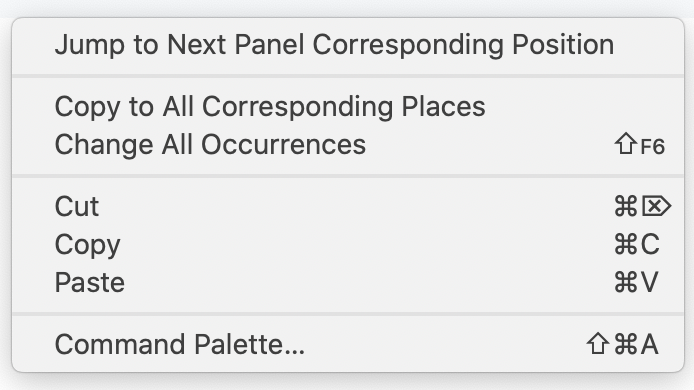

# Sync Scroll - Visual Studio Code extension

A Visual Studio Code extension that makes sync scrolling editing easier.

## Features

This extension supports sync scrolling between split panels in different modes:

- **NORMAL**: Sync scroll to the same line
- **OFF**: Turn off sync scroll

You can change the mode of Sync Scroll in the status bar below when VSCode opens split panels.

NOTE: the default mode is **OFF**, plesae select your desired mode after you firstly install it and open split panels.

It can help you highlight the corresponding selections when you focus the cursor on the one side.
Additionally, there are two commands help your cross editing in the right-click menu in the content window when you open the split panels.

- `Jump to Next Panel Corresponding Position` for navigating around the panels and in the corresponding position. It's very convenient to quick focus on the other side.
- `Copy to All Corresponding Places` for replacing all the text at corresponding positions from the selections. For example, it's for the case that you want to use the selected text on the left side also on the right side.

## Release Notes

### 1.4.0

Fixes:

- Fixed ~5 line scroll desynchronization in NORMAL mode. Root cause: VS Code's `revealRange(AtTop)` adds internal padding (~5 lines). Fix: post-scroll "settle" mechanism (100ms) that measures actual gap and corrects via compensated `revealRange`.
- Fixed sync activation bug requiring multiple panel clicks before sync starts. Root cause: `scrolledEditorsQueue` retained stale entries after settle correction, silently dropping subsequent user scroll events.

Changes:

- Removed OFFSET mode (unused, non-functional). Only NORMAL and OFF modes remain.
- Removed dead calibration system (calibrationOffset always measured 0, superseded by settle correction).
- General code cleanup: removed diagnostic logs, dead code, and unused branches.

### 1.3.1

Enhancement:

- Simplified the on/off and mode interaction into one menu with two modes: NORMAL and OFF.
- By default mode is OFF.

### 1.3.0

Add features:

- Add command to jump to corresponding position in the next panel
- Add command to copy selections to all corresponding positions.

Enhancement:

- Fix the issue of the output panel which shouldn't be involved in the scrolling sync.

### 1.2.0

Add features:

- Add corresponding line highlight feature.

Enhancement:

- Fix back and forth scroll issue in diff(selecting file to compare)/scm(viewing file changes) case.

### 1.1.1

Enhancement:

- Persist the toggle state and mode
- Fix back and forth scroll issue in diff(selecting file to compare)/scm(viewing file changes) case.

### 1.1.0

Add features:

- Now you can choose a sync mode when it turns on:
  - NORMAL - aligned by the top of the view range.

Enhancement:

- Get rid of the scrolling delay.
- Fix the issue that cannot toggle on/off when not focus on any editor.
  
### 1.0.0

Initial release of Sync Scroll with features:

* Can set all the split panels into scroll synchronized mode.

-----------------------------------------------------------------------------------------------------------

## How to Contribute

This extension is created by VSCode Extension Template (TypeScript) by [Yeoman](https://vscode.readthedocs.io/en/latest/extensions/yocode/).

Basically, you can work with this extension source code as a normal typescript project.
