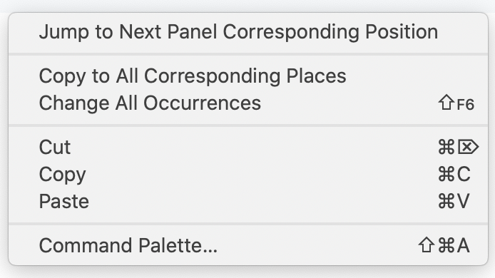

# Sync Scroll (Revived)

Maintained fork of [Sync Scroll](https://github.com/dqisme/vscode-sync-scroll) that addresses the scroll desynchronization bug reported since 2022.

If you used the original Sync Scroll extension and noticed the panels were always off by a few lines, this fork improves that considerably. A few residual cases remain and are documented under [Known Limitations](#known-limitations).

## What's New in 1.4.0

- **Scroll desync largely corrected** - The original extension left a persistent offset of about 5 lines between panels. Panels now line up in normal use. After you stop scrolling, the extension re-checks the panels and nudges them back into alignment if they drifted. This second pass is a best effort: it does not apply everywhere, and the cases where it does not are listed under Known Limitations.
- **Activation fixed** - Sync starts as soon as you select a mode. No more clicking through several panels before it takes effect.
- **OFFSET mode removed** - This mode was non-functional and has been removed. Only NORMAL and OFF remain.
- **Code cleanup** - Removed dead code, an unused calibration system, and diagnostic logs.

## How to Use

**Activate sync scrolling (pick one):**
- Click **Sync Scroll: OFF** in the bottom status bar, then select **NORMAL**
- Or open Command Palette (`Ctrl+Shift+P` / `Cmd+Shift+P`) and search `Change Sync Scroll Mode`

**Modes:**
- **NORMAL** - Both panels scroll to the same line
- **OFF** - Panels scroll independently (default)

**Command Palette:**
- **Change Sync Scroll Mode** - Opens the mode picker, same as clicking the status bar indicator
- **Toggle Sync Scroll** - Switches sync off, or back on to NORMAL. Faster than the picker when you only need to interrupt sync briefly. No keyboard shortcut is bound by default; you can assign one from **Keyboard Shortcuts**.

**Right-click commands (when split panels are open):**
- **Jump to Next Panel Corresponding Position** - Moves your cursor to the same line in the other panel
- **Copy to All Corresponding Places** - Select text in one panel, right-click, and it replaces the text at the same position in the other panel(s)

**Corresponding line highlight:**
When sync is on, placing your cursor in one panel highlights the matching line in the other panels. This is automatic and has no command of its own.

## Getting Started

1. Open a file in split view: `Ctrl+\` (or `Cmd+\` on Mac)
2. Click **Sync Scroll: OFF** in the bottom status bar
3. Select **NORMAL** from the menu
4. Scroll in either panel. The other follows automatically.

> The default mode is **OFF**. To activate sync scrolling, either click the status bar indicator and select NORMAL, or open the Command Palette (`Ctrl+Shift+P` / `Cmd+Shift+P`) and search for `Change Sync Scroll Mode`.

## Known Limitations

These are known and currently unfixed. They are listed so you know what to expect, not as a roadmap.

**Scrolling**

- Fast scrolling can drift by a line or two. The extension usually pulls the panels back together shortly after you stop.
- Near the top of a file, that automatic re-alignment may not apply. A small offset can persist there until you scroll further down.
- Closing a panel, or opening a new one, while a scroll is still in progress can briefly disturb the sync. Scrolling again restores it.
- After using **Toggle Sync Scroll** to switch sync off and back on, the first scroll gesture may be ignored. Scroll again and sync resumes.

**Commands**

- **Jump to Next Panel Corresponding Position** does not cycle correctly beyond two panels. With three panels or more, some panels cannot be reached from certain others; the command keeps alternating between the same two.
- **Copy to All Corresponding Places** always pastes from the start of the target line. If your selection begins in the middle of a line, whatever came before it on the target line is lost.

## Release Notes

### 1.4.0

Fixes:
- Corrected the roughly 5 line scroll desynchronization in NORMAL mode, with the residual cases listed under Known Limitations.
- Fixed the activation issue that required clicking through several panels before sync started.

Changes:
- Removed OFFSET mode, which was non-functional.
- Removed the dead calibration system.
- Renamed the extension to Sync Scroll (Revived) and repointed it at this fork.
- General code cleanup.

### Previous versions

See [CHANGELOG.md](./CHANGELOG.md) for the full history, including versions inherited from the [original extension](https://github.com/dqisme/vscode-sync-scroll).

## Maintenance & Contribution

**Documentation rule.** Any commit that changes the behaviour of the extension must update `README.md` and `CHANGELOG.md` in the same commit. This covers new or removed commands, changed modes, changed scroll behaviour, and any limitation that appears or disappears. A behaviour change landed without a documentation update is treated as incomplete.

Where the two files disagree, **`README.md` is authoritative**: it describes the current state of the extension. `CHANGELOG.md` is an append-only historical record and its past entries are never rewritten to match the present.

Issues and pull requests welcome on the [GitHub repository](https://github.com/Rydelex/Scroll).

## Credits

Fork of [dqisme/vscode-sync-scroll](https://github.com/dqisme/vscode-sync-scroll) - MIT License.
Original author: [DQ](https://github.com/dqisme). Maintained by [Rydelex](https://github.com/Rydelex).
